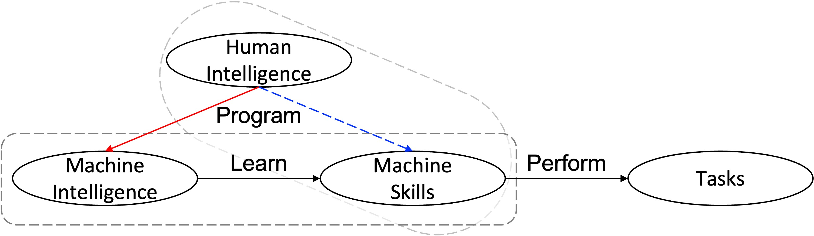
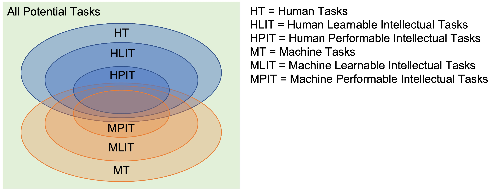

# AGI-Survey
This repository maintains a survey of Artificial General Intelligence (AGI).
This survey is ongoing, since it cannot be finished in a short term.

The survey will be organized according to the following taxonomy

 - Working Definition
 - Formal Language/Knowledge Representation
 - Interaction-Rules of Representations
 - Organizing Mechanisms
 - Cognitive Functions
 - Performance

(For the moment, see [this post](https://medium.com/@tuq24215/artificial-genral-intelligence-what-it-is-how-to-evaluate-it-and-how-to-realize-it-d4d03e9707ac) for more intepretations)

This survey will include not only research in the field of AGI, but also research related to AGI in philosophy, psychology, cognitive science, brain science, and so on.

> #### ❗**Note:** The following list of papers is continuously being updated ...
> Please feel free to [contact me](http://www.xubowen.net) if you have any ideas, would like to add more references, or have any other suggestions.

# Prelude

 - Turing, A. M. (1950). Computing Machinery and Intelligence. Mind, LIX(236), 433–460. | [paper](https://academic.oup.com/mind/article-pdf/LIX/236/433/30123314/lix-236-433.pdf)

 - Wang, P., & Goertzel, B. (2007). Introduction: Aspects of artificial general intelligence. In Advances in Artificial General Intelligence: Concepts, Architectures and Algorithms (pp. 1-16). IOS Press. | [paper](https://ebooks.iospress.nl/volumearticle/3470)

 - Wang, P., Goertzel, B. (2012). Introduction: What Is the Matter Here?. In: Wang, P., Goertzel, B. (eds) Theoretical Foundations of Artificial General Intelligence. Atlantis Thinking Machines, vol 4. Atlantis Press, Paris. | [paper](https://link.springer.com/chapter/10.2991/978-94-91216-62-6_1)

 - Wang, P.. Artificial General Intelligence — A gentle introduction. | [page](https://cis.temple.edu/~pwang/AGI-Intro.html)

 - Mitchell, M. (2024). Debates on the nature of artificial general intelligence. Science, 383(6689), eado7069. | [paper](https://www.science.org/doi/10.1126/science.ado7069)  

# Definitions

 - **[Collection of Definitions]** Legg, S., & Hutter, M. (2007). A collection of definitions of intelligence. Frontiers in Artificial Intelligence and applications, 157, 17. | [paper](http://www.hutter1.net/ai/idefs.pdf)

 - Legg, S., & Hutter, M. (2007). Universal intelligence: A definition of machine intelligence. Minds and machines, 17, 391-444. | [paper](https://link.springer.com/content/pdf/10.1007/s11023-007-9079-x.pdf)

 - Wang, P. (2019). On defining artificial intelligence. Journal of Artificial General Intelligence, 10(2), 1-37. | [paper](https://intapi.sciendo.com/pdf/10.2478/jagi-2019-0002)

 - Xu, B. (2024). What is Meant by AGI? On the Definition of Artificial General Intelligence. arXiv preprint arXiv:2404.10731. | [paper](https://arxiv.org/pdf/2404.10731)

 - **[Sparks of AGI]** Bubeck, S., Chandrasekaran, V., Eldan, R., Gehrke, J., Horvitz, E., Kamar, E., ... & Zhang, Y. (2023). Sparks of artificial general intelligence: Early experiments with gpt-4. arXiv preprint arXiv:2303.12712. | [paper](https://arxiv.org/pdf/2303.12712)
   - “We use AGI to refer to systems that demonstrate broad capabilities of intelligence, including reasoning, planning, and the ability to learn from experience, and with these capabilities at or above human-level.”

 - [Andrew Ng's description posted on X](https://twitter.com/AndrewYNg/status/1766589035781202423):
    - > The definition of AGI I use is "AI that can perform any intellectual task that a human can."
    <!-- - Comment: This is an ill-considered (or, at least, misleading) definition -- (1) the definition is not proper if we admit that an infant possesses general intelligence, since infants cannot perform (without learning) most intellectual tasks that adults can (*e.g.*, playing the game of Go, complex decision making, mathematics, *etc.*); (2) If "perform" is interpreted as "learn to do", some intellectual tasks may need human-specific experience. -->

 - **[Levels of AGI]** Morris, M. R., Sohl-Dickstein, J., Fiedel, N., Warkentin, T., Dafoe, A., Faust, A., ... & Legg, S. (2023). Levels of AGI: Operationalizing Progress on the Path to AGI. arXiv preprint arXiv:2311.02462. | [paper](https://arxiv.org/pdf/2311.02462) 
   - A related coverage: Google DeepMind wants to define what counts as artificial general intelligence, Nov 2023, MIT Technology Review. | [link](https://www.technologyreview.com/2023/11/16/1083498/google-deepmind-what-is-artificial-general-intelligence-agi/)
   - [Wikipedia](https://en.wikipedia.org/wiki/Artificial_general_intelligence) refers to DeepMind's definition (accessed on August 29, 2024), "Artificial general intelligence (AGI) is a type of artificial intelligence (AI) that matches or surpasses human capabilities across a wide range of cognitive tasks."
 - Chollet, F. (2019). On the measure of intelligence. arXiv preprint arXiv:1911.01547. | [paper](https://arxiv.org/pdf/1911.01547) | [code](https://github.com/fchollet/ARC-AGI) | [page](https://arcprize.org/arc)
  

**Figure 1.a.** “Causal graph” for performing tasks.

**Figure 1.b.** “Human intelligence” is a *confounder*. ([Xu, 2024](https://openreview.net/pdf?id=3SBYJI4sv4))

**Figure 2.** Different types of tasks.

## Notions

 - Intelligence, General Intelligence, Skill
 - Adaptation, Generalization
 - System, Environmnent, Agent

# Theoretical Foundations

 - **Philosophy**
   - ***Epistemology***
   - ***Mind and Consciousness***
     - Kim, J. (2018). Philosophy of mind (Third edition). Routledge. | [book](https://www.routledge.com/Philosophy-of-Mind/Kim/p/book/9780813344584)
 - **Linguistics**
 - **Psychology and CogSci**
   - **[Piaget]** Müller, U., Ten Eycke, K., & Baker, L. (2015). Piaget’s Theory of Intelligence. In S. Goldstein, D. Princiotta, & J. A. Naglieri (Eds.), Handbook of Intelligence: Evolutionary Theory, Historical Perspective, and Current Concepts (pp. 137–151). Springer. ｜ [book section](https://doi.org/10.1007/978-1-4939-1562-0_10)
   - ***Memory***
   - ***Attention***
   - ***Motivation***
     - Allport, G. W. (1937). The Functional Autonomy of Motives. The American Journal of Psychology, 50(1/4), 141–156. | [paper](https://psychclassics.yorku.ca/Allport/autonomy.htm)
   - ***Resource Management***
     - Lieder, F., & Griffiths, T. L. (2019). Resource-rational analysis: Understanding human cognition as the optimal use of limited computational resources. The Behavioral and Brain Sciences, 43, e1. | [paper](https://doi.org/10.1017/S0140525X1900061X)
   - ***Planning***
   - ***Learning***
   - ***Perception***
   - ***Reasoning***
   - ***Language***
   - ***Decision Making***
   - ***Development***
   - ***Meta-cognition***
 - **Brain Science and Neuroscience**
   - ***Cerebral Neocortex***
   - ***Predictive Coding***
   - ***Free Energy Principle***
 - **Mathematics and Computer Science**
   - ***Logic***
   - ***Probability and Statistics***
   - ***Linear Algebra and Calculus***
   - ***Graph Theory***
   - ***Optimization***
   - ***Search Algorithms***
   - ***Game Theory***
   - ***Quantum Computing***
 - **Artificial Intelligence**
   - === Approaches ===
   - ***Reinforcement Learning***
     - Sutton, R. S., & Barto, A. G. (2018). Reinforcement Learning: An Introduction (second edition). MIT Press. | [book](http://incompleteideas.net/book/RLbook2020.pdf)
   - ***Expert Systems***
   - ***Neural Networks***
     - LeCun, Y., Bengio, Y. & Hinton, G. Deep learning. Nature 521, 436–444 (2015).
     - Goodfellow, I., Bengio, Y., & Courville, A. (2016). Deep learning (Vol. 196). MIT press. | [e-textbook](https://www.deeplearningbook.org/)
     - **[Spiking Neural Networks]** Gerstner, W., Kistler, W. M., Naud, R., & Paninski, L. (2014). Neuronal Dynamics: From Single Neurons to Networks and Models of Cognition. Cambridge University Press. | [book](https://doi.org/10.1017/CBO9781107447615)
   - ***Bayesianism and Probabilistic Graphical Models***
   - === Subfields ===
   - ***Machine Learning***
     - Mitchell, T. M., & Mitchell, T. M. (1997). Machine learning (Vol. 1, No. 9). New York: McGraw-hill. | [textbook](https://www.cs.cmu.edu/~tom/files/MachineLearningTomMitchell.pdf)
   - ***Computer Vision***
     - Marr, D. (1982). Vision: A Computational Investigation into the Human Representation and Processing of Visual Information. W. H. Freeman and Company. | [book](https://people.ciirc.cvut.cz/~hlavac/pub/MiscTextForStudents/1982MarrDavidVisionBook.pdf)
   - ***Natural Languge Processing***
   - ***Robotics***
   - ***Game Playing***
   - ***Others***

# Theories/Projects

 - Wang, P., & Goertzel, B. (Eds.). (2012). Theoretical foundations of artificial general intelligence (Vol. 4). Springer Science & Business Media. | [book](https://link.springer.com/book/10.2991/978-94-91216-62-6)
 - Wang, P. (2009). Insufficient knowledge and resources—A biological constraint and its functional implications. 2009 AAAI Fall Symposium Series. | [paper](https://cis.temple.edu/~pwang/Publication/AIKR.pdf)
   - The assumption on insufficient knowledge and resources is crucial for AI
 - **[Cognitive Architectures]** Kotseruba, I., Tsotsos, J.K. 40 years of cognitive architectures: core cognitive abilities and practical applications. Artif Intell Rev 53, 17–94 (2020). | [paper](https://link.springer.com/content/pdf/10.1007/s10462-018-9646-y.pdf)
   - Samsonovich, A. V. (2010). Toward a unified catalog of implemented cognitive architectures. In Biologically inspired cognitive architectures 2010 (pp. 195-244). IOS Press. | [paper](https://www.researchgate.net/profile/Alexei-Samsonovich/publication/221313271_Toward_a_Unified_Catalog_of_Implemented_Cognitive_Architectures/links/5401c2730cf2bba34c1b2145/Toward-a-Unified-Catalog-of-Implemented-Cognitive-Architectures.pdf)
   - Goertzel, B., Lian, R., Arel, I., De Garis, H., & Chen, S. (2010). A world survey of artificial brain projects, Part II: Biologically inspired cognitive architectures. Neurocomputing, 74(1-3), 30-49. | [paper](https://www.academia.edu/download/28847454/2009-A-world-survey-of-artificial-brain-projects-Part-II_Biologically-inspired-cognitive-architectures.pdf)

 - **[FEP&AIF]** Parr, T., Pezzulo, G., & Friston, K. J. (2022). Active inference: the free energy principle in mind, brain, and behavior. MIT Press. | [book](https://direct.mit.edu/books/book-pdf/2246566/book_9780262369978.pdf)
    - *Free Energy Principle* and *Active Inference*

 - **[GPT-4]** Bubeck, S., Chandrasekaran, V., Eldan, R., Gehrke, J., Horvitz, E., Kamar, E., ... & Zhang, Y. (2023). Sparks of artificial general intelligence: Early experiments with gpt-4. arXiv preprint arXiv:2303.12712. | [paper](https://arxiv.org/pdf/2303.12712)
   - Vaswani, A. (2017). Attention is all you need. Advances in Neural Information Processing Systems. | [paper](https://proceedings.neurips.cc/paper_files/paper/2017/file/3f5ee243547dee91fbd053c1c4a845aa-Paper.pdf)
   - [A survey majorly from the perspective of LLMs. It contains the recent progress of LLMs (by May 2024)] Feng, T., Jin, C., Liu, J., Zhu, K., Tu, H., Cheng, Z., ... & You, J. (2024). How Far Are We From AGI. arXiv preprint arXiv:2405.10313. | [paper](https://arxiv.org/abs/2405.10313).
 - **[JEPA]** LeCun, Y. (2022). A path towards autonomous machine intelligence version 0.9. 2, 2022-06-27. Open Review, 62(1), 1-62. | [paper](https://openreview.net/pdf?id=BZ5a1r-kVsf)
 - **[NARS]** Wang, P. (2022, April). Intelligence: From definition to design. In International Workshop on Self-Supervised Learning (pp. 35-47). PMLR. | [paper](https://proceedings.mlr.press/v192/wang22a/wang22a.pdf) | [code](https://github.com/opennars/opennars) | [page](https://www.opennars.org/)
   - *Non-Axiomatic Reasoning System*
   - **[*Logic*]** Wang, P. (2013). Non-axiomatic logic: A model of intelligent reasoning. World Scientific. | [book](https://www.worldscientific.com/worldscibooks/10.1142/8665#t=aboutBook)
   - **[*Motivation*]** 
     - Wang, P. (2012). Motivation Management in AGI Systems. In J. Bach, B. Goertzel, & M. Iklé (Eds.), Artificial General Intelligence (pp. 352–361). Springer. | [paper](https://doi.org/10.1007/978-3-642-35506-6_36)
     - Hahm, C., Xu, B., & Wang, P. (2022). Goal Generation and Management in NARS. In B. Goertzel, M. Iklé, & A. Potapov (Eds.), Artificial General Intelligence (pp. 96–105). Springer International Publishing. | [paper](https://doi.org/10.1007/978-3-030-93758-4_11)

 - **[AIXI]** Legg, S., & Hutter, M. (2007). Universal intelligence: A definition of machine intelligence. Minds and machines, 17, 391-444. | [paper](https://link.springer.com/content/pdf/10.1007/s11023-007-9079-x.pdf)
  
 - **[Standard model of ACT-R/Sigma/Soar]** Laird, J. E., Lebiere, C., & Rosenbloom, P. S. (2017). A standard model of the mind: Toward a common computational framework across artificial intelligence, cognitive science, neuroscience, and robotics. Ai Magazine, 38(4), 13-26. | [paper](https://onlinelibrary.wiley.com/doi/pdf/10.1609/aimag.v38i4.2744)
 - **[HTM/Thousand Brain Theory]**  Hole, K. J., & Ahmad, S. (2021). A thousand brains: toward biologically constrained AI. SN Applied Sciences, 3(8), 743. | [paper](https://link.springer.com/content/pdf/10.1007/s42452-021-04715-0.pdf)

# Evaluation

 - **[ARC dataset]** Chollet, F. (2019). On the measure of intelligence. arXiv preprint arXiv:1911.01547. | [paper](https://arxiv.org/pdf/1911.01547) | [code](https://github.com/fchollet/ARC-AGI) | [page](https://arcprize.org/arc)
 - **[Artificial Open World]** Xu, B., & Ren, Q. (2022, August). Artificial Open World for Evaluating AGI: A Conceptual Design. In International Conference on Artificial General Intelligence (pp. 452-463). Cham: Springer International Publishing. | [paper](https://link.springer.com/chapter/10.1007/978-3-031-19907-3_43)
 - **[The Tong Test]** Peng, Y., Han, J., Zhang, Z., Fan, L., Liu, T., Qi, S., ... & Zhu, S. C. (2024). The tong test: Evaluating artificial general intelligence through dynamic embodied physical and social interactions. Engineering, 34, 12-22. | [paper](https://www.sciencedirect.com/science/article/pii/S209580992300293X/pdfft?md5=12814df6f2334a3895a81de418cbf041&pid=1-s2.0-S209580992300293X-main.pdf)
 - **[I-athlon]** Adams, S. S., Banavar, G., & Campbell, M. (2016). I-athlon: Towards a multidimensional turing test. AI Magazine, 37(1), 78-84. | [paper](https://onlinelibrary.wiley.com/doi/pdf/10.1609/aimag.v37i1.2643)
 - Wang, P. (2010, June). The evaluation of AGI systems. In 3d Conference on Artificial General Intelligence (AGI-2010) (pp. 154-159). Atlantis | Press. | [paper](https://www.researchgate.net/profile/Pei-Wang-41/publication/242783711_The_evaluation_of_AGI_systems/links/54da32360cf2970e4e7e6614/The-evaluation-of-AGI-systems.pdf)
 - **Machine Learning Benchmarks**

# Miscellaneous Issues

 - **Embodiment**
 - **Hallucination**
 - **Scalability**
 - **Interpretability**
 - **Understanding**
 - **Alignment**
 - **Safety**
 - **Consciousness**
   - Chalmers, D. J. (2023). Could a Large Language Model Be Conscious? Boston Review, 1. | [page](https://www.bostonreview.net/articles/could-a-large-language-model-be-conscious/)
   - Seth, A. (2024). Conscious artificial intelligence and biological naturalism. OSF. (PsyArXiv) | [preprint](https://doi.org/10.31234/osf.io/tz6an)
   - Wang, P. (2020). A Constructive Explanation of Consciousness. Journal of Artificial Intelligence and Consciousness, 07(02), 257–275. | [paper](https://doi.org/10.1142/S2705078520500125)
     - Consciousness is self-awareness and self-control
   - Xu, B., Zhan, X., & Ren, Q. (2022). The Gap Between Intelligence and Mind. In B. Goertzel, M. Iklé, & A. Potapov (Eds.), Artificial General Intelligence (pp. 292–305). Springer International Publishing. | [paper](https://doi.org/10.1007/978-3-030-93758-4_31)

